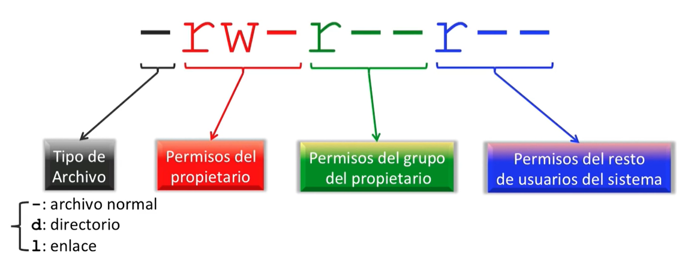

# Comandos

## Useful Commands for Navigating
`ls` Listar archivos y carpetas  
`cd` Change directory - Navegar entre directorios  
`pwd` Muestra el directorio actual  
`mkdir` Crear un directorio  
`rmdir` Remove directory (only works if empty)  

## Commands for Working with Files
`touch` Creates a file or updates the timestamp on an existing file  
`cat` Outputs the full contents of a file  
`head` Returns the first X lines of a file starting at the top  
`tail` Returns the first X lines of a file starting at the bottom  
`cp` Copies a file or directory  
`rm` Removes a file or directory  
`mv` Moves a file or folder  
`less` Displays contents of file while allowing easy scrolling up and down  
`diff` Compares two files for differences  
`cmp` Checks if two files are identical on a byte-by-byte level  
`file` Gets information on file type  
`colordiff` Compare the two files and observe the difference  

## Command Information
`type` Get information on a command  
`which` Find the location of the executable  
`whereis` Find the executable location, source, and manual  
`locate` Search a database index of the filesystem  

## Permisos
`groups <username>` What groups a user is in  
`chmod ... ...` Cambiar permisos  

Tipo de Archivo
`-` Archivo Normal
`d` Directorio
`l` Enlace

Permisos del Propietario
Permisos del Grupo del Propietario
Permisos del Resto de Usuarios del Sistema

n | Name    | -
--|---------|--
4 | Read    | r
2 | Write   | w
1 | Execute | x

**Ejemplo:**  
`chmod 777` owner: rwx - group: rwx - world: rwx  
`chmod 755` owner: rw  - group: rx  - world: rx  

## Compresion
`tar cf ....tar` Generar archivo .tar  
`tar xf ....tar` Extraer archivo
`tar tf ....tar` Mostrar contenido del archivo  

`gzip ...` Generar gzip de un archivo  
`gzip -d ....gz` Extraer archivo

## SSH
`ssh user@host` Conectar al host  
`ssh -p port user@host` Se conecta mediante el puerto  
`ssh -D port user@host` Conecta y usa bind port  

## Otros
`sudo` Super Usuario DO  
`clear` Limpia la consola  
`history` Muestra el historial de comandos  
`uname -a` Muestra info del sistema

## Monitoreo de Procesos
`top` Muestra los procesos  
`htop` Muestra los procesos con mas info

`ps` Muestra procesos activos  
`ps aux` Muestra procesos activos detallados  

`kill ...` Matar proceso con el ID  
`killall ...` Matar todos procesos de nombre  

`bg` Lista procesos de fondo  
`fg`  
`fg n`  

## Network
`ping ...` Muestra ip de un dominio  
`who is ...` Detalles de un Dominio  

`dig ...` Retorna el DNS de un dominio  
`dig -x ...` Busqueda invertida de host

`wget ...` Descargar un archivo  
`wget -c ...` Continua una descarga  
`wget -r ...` Descarga recursivamente archivos de una url

`ifconfig` Muestra la info del red  
`iwconfig` Muestra la info del wifi  

## Informacion del Sistema
`date` Ver hora y fecha actual  
`cal` Muestra calendario del mes  
`uptime` Muestra uptime

`w` Usuarios logueados  
`whoami` Muestra el usuario con el que estoy logueado  

`man ...` Informacion de un comando  

`df` Muestra espacio en disco  
`du` Muestra espacio usado  

`lsusb` Muestra las unidades USB
`blkid` Muestra info de los discos  

## Package Manager

`sudo apt install` Instalar paquete  
`sudo apt remove` Remover paquete  

`sudo apt update` Refrescar index del repositorio  
`sudo apt upgrade` Actualizar todos los paquetes actualizables  

`sudo apt purge` Remover paquete con configuracion  
`sudo apt autoremove` Remover paquetes innecesarios  
`sudo apt search` Buscar un programa  
`sudo apt show` Mostrar info de un paquete  
`sudo apt list` Listar paquetes con criterio (installed, upgradable etc)  

`sudo apt edit-sources` Editar sources list  
`sudo apt full-upgrade` Upgrades packages with auto-handling of dependencies  

## Remove a PPA
`sudo add-apt-repository --remove ppa:PPA_Name/ppa`

